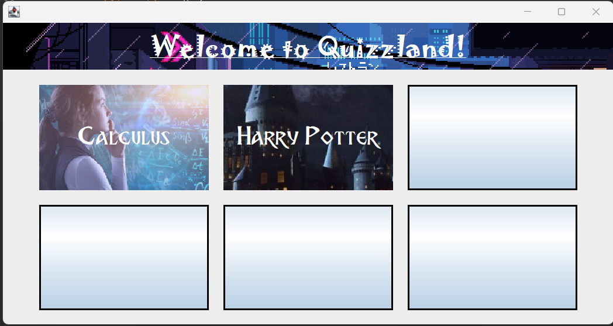
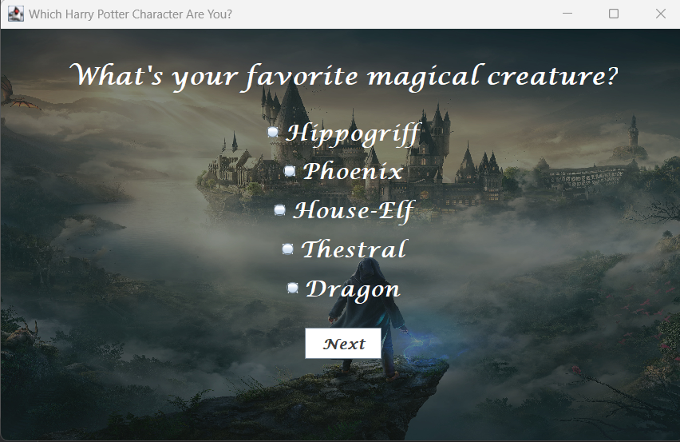
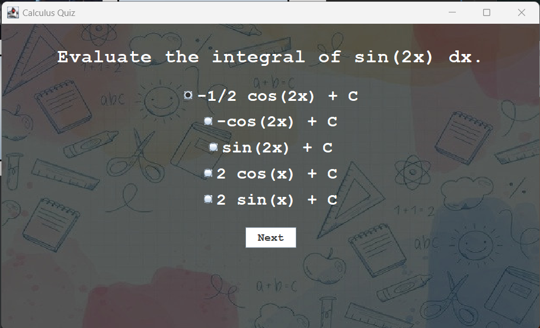
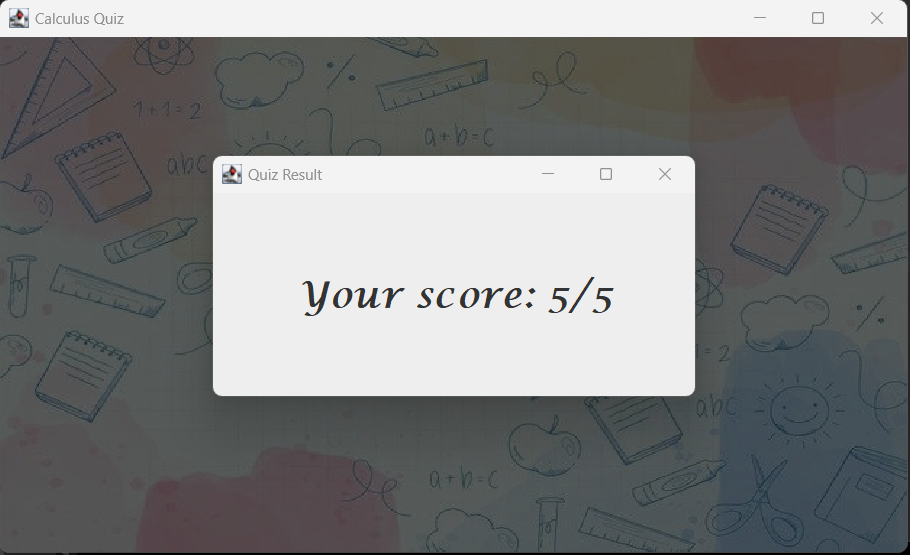

<<<<<<< HEAD
# Quizzland: A Fun Quiz Interface in Java!

Welcome to QuizLand, an exciting project that allows you to create and play quizzes using Java Swing, a graphical user interface library for Java. This project was originally created for the Hacktoberfest event at MIT-ADT, but we invite everyone to join in the fun! You can create your own quiz and add it to the main interface. Below, we have included some demo pictures to help you get started:

## Main Interface:



## Harry Potter Quiz Example:



### Results:


## Calculus Quiz Example:



### Results:



# Create Your Own Quiz and Add It to the Interface!

## Rules:

**Step 0: Get Started with Git and GitHub**
0. If you're new to Git and GitHub, don't worry! It's a way to manage your project's code. Start by forking this repository (click the "Fork" button on the top right) and then clone your fork. Here's a helpful guide: [Getting Started with Git and GitHub](https://github.com/firstcontributions/first-contributions).

**Step 1: Set Up Your Quiz Folder**
1. Open your favorite Integrated Development Environment (IDE). If you're new to this, we recommend using Eclipse for Java—it's beginner-friendly!
2. Create a folder named after your quiz under the "quizzes" folder in the project.

**Step 2: Customize Your Quiz**
2. It's time to create your quiz! If you want to make a quiz where users can choose from options (like "Which <insert_fandom> character are you?"), you can start by copying the structure from the Harry Potter quiz. Modify the questions and answer arrays to match your quiz. Here's how to do it:

```java
private String[] questions = {
   "What's your favorite magical creature?",
   "Which subject at Hogwarts do you excel in?",
   // Add as many questions as you'd like
};

private String[][] answerChoices = {
   {"Hippogriff", "Phoenix", "House-Elf", "Thestral", "Dragon"},
   {"Defense Against the Dark Arts", "Transfiguration", "Potions", "Charms", "Divination"},
   // Add corresponding answer choices for each question
};
```

3. If your quiz has only one correct answer, like the Calculus quiz, you can copy that structure and make changes to the title, questions, answers, fonts, and so on. 
4. Otherwise, get creative, use another logic and design your quiz the way you like!

**Step 3: Organize Your Resources**
5. Add background and result images to the "img" folder inside your quiz folder. Make sure to link them in your quiz code as shown in the original quizzes. You can also add customizations like fonts—just create a folder in your quiz directory to stay organized!

## Adding Your Quiz to the Main Interface:
**Step 5: Integrate Your Quiz**
6. Open "src/QuizMaster.java" in your IDE. 
7. In the createAndShowGUI() function, add the following code snippet. 
```java

JButton your_quiz_name_Button = createStyledButton("your_quiz_title", "font_name", "./img/your_quiz_img.jpg");

your_quiz_name_Button.addActionListener(new ActionListener() {
    @Override
    public void actionPerformed(ActionEvent e) {
        your_quiz_name quizInstance = new your_quiz_name();
    }
});

buttonPanel.add(your_quiz_name_Button);
```
8. Replace "your_quiz_name" with the class name for your quiz (also the file name).
9. Be sure to include an image in the first "img" directory for your quiz to display an image on the interface.


*Step 6: Final Steps*
10. You're all set! After creating your quiz, add, commit, and push your changes to your forked repository. 
11. Then, submit a pull request for review. If you've done a good job, it will be accepted soon!

Good luck & happy Hacktoberfest! 🎃

=======
# Quizland
Create your own Quizzes in Java!!
>>>>>>> 72245aadd298d44f9f728371454998071e3fc4d9
